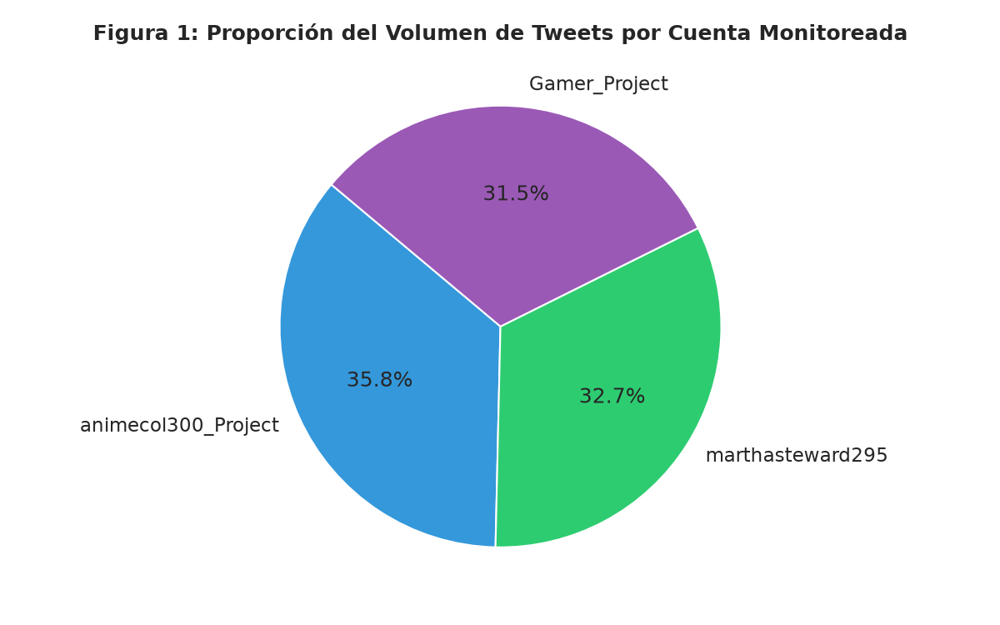
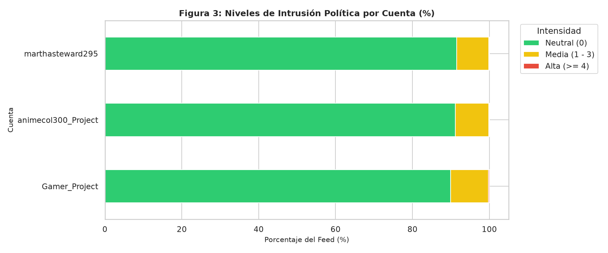
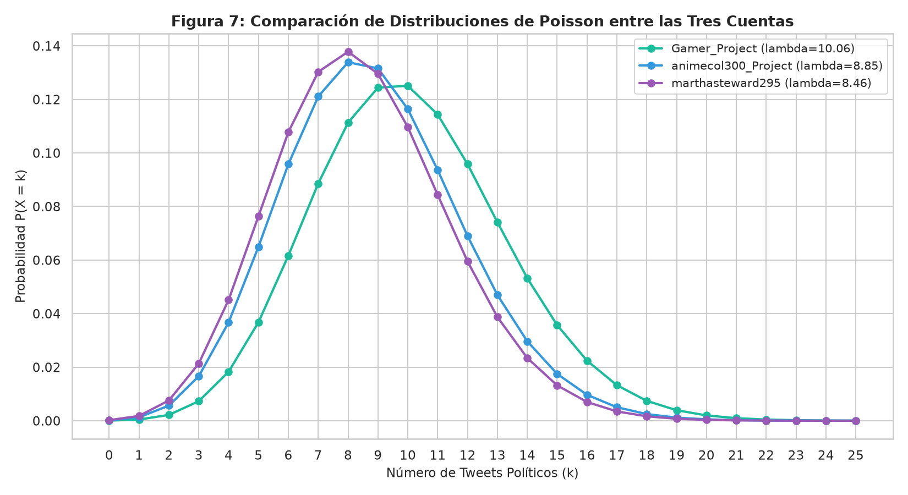
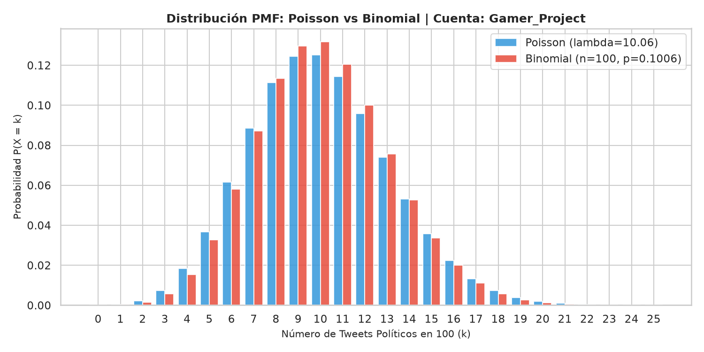
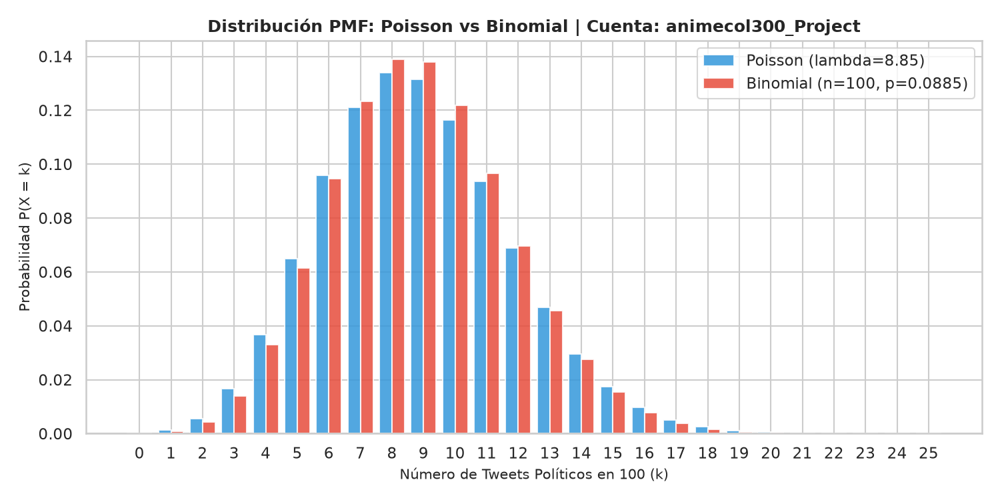
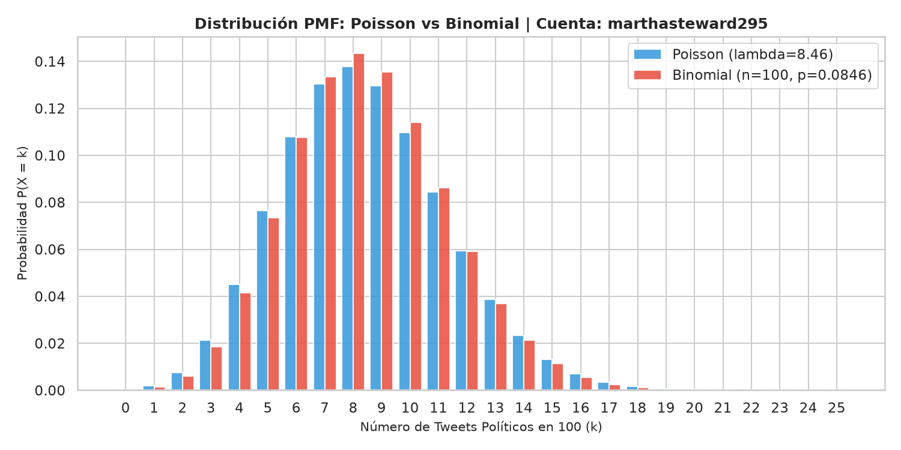
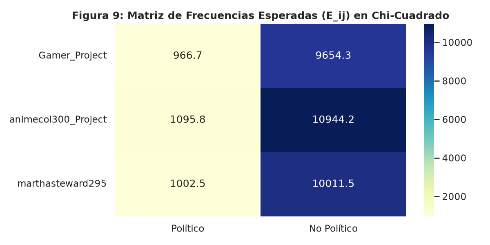
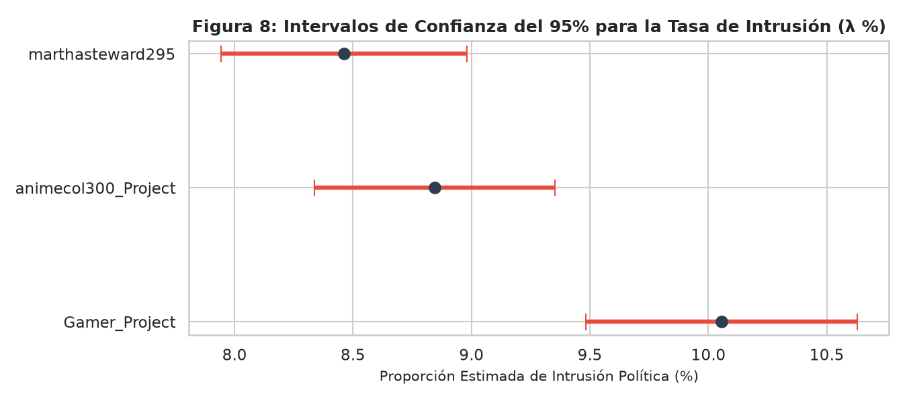
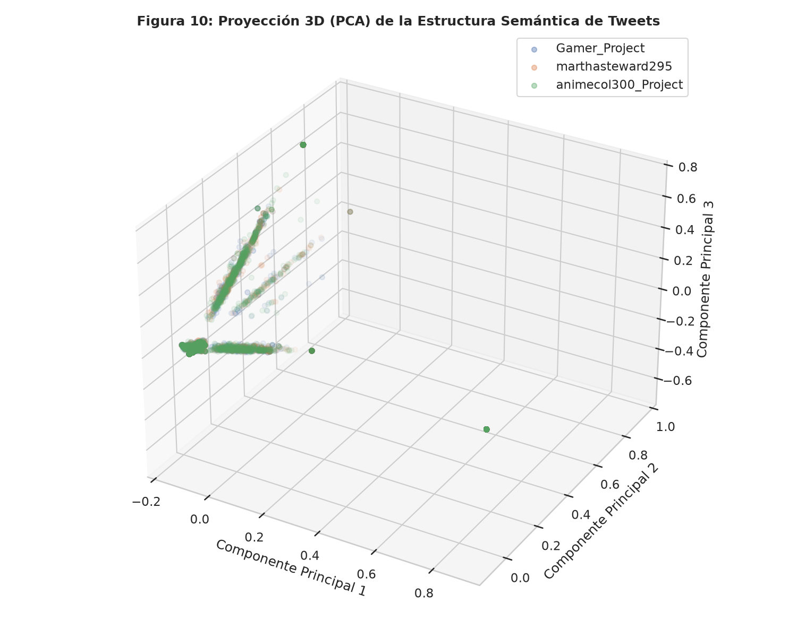
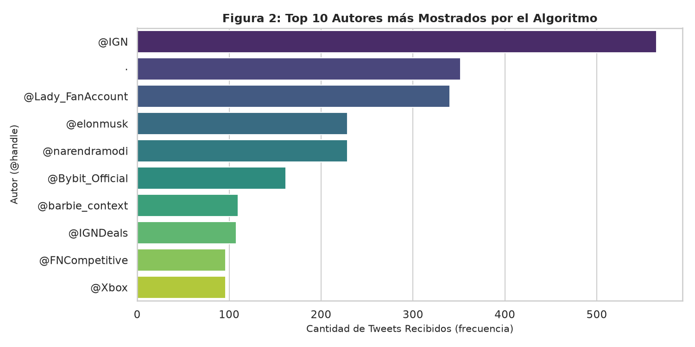

# 📊 Auditoría de Algoritmos de Recomendación en la Red Social X (Twitter)

> **Modelado Matemático, Procesamiento de Lenguaje Natural (NLP) y Análisis Estadístico de Intrusión de Contenido Político en Cuentas de Control Apolíticas.**

---

## 📌 Visión General

Este proyecto realiza una **auditoria cuantitativa y algorítmica** sobre el sistema de recomendación de la red social **X (Twitter)**. El objetivo principal es determinar con rigor estadístico si existe una **intrusión sistemática de contenido político** no solicitado en cuentas de usuario completamente apolíticas y evaluar si la intensidad de esta intrusión presenta una personalización algorítmica diferencial.

Para el estudio se recolectaron y analizaron **33,675 publicaciones (tweets)** durante el periodo experimental a través de **tres cuentas de control apolíticas**:
1. 🎮 **`Gamer_Project`** (`@gamer`): 10,621 tweets capturados.
2. 🎌 **`animecol300_Project`** (`@animecol`): 12,040 tweets capturados.
3. 🏡 **`marthasteward295`** (`@marthasteward`): 11,014 tweets capturados.

---

## 🧮 Resultados Matemáticos y Estadísticos Clave

### 1. Modelo de Distribución de Poisson
La intrusión de tweets políticos por cada bloque de $n = 100$ publicaciones en la línea de tiempo se modeló mediante una variable aleatoria discreta de Poisson $X \sim \text{Poisson}(\lambda)$:

$$P(X = k) = \frac{\lambda^k \cdot e^{-\lambda}}{k!}$$

| Cuenta de Control | Tweets Totales | Tweets Políticos | Tasa Promedio ($\lambda$) | $P(X = 0)$ (Sin política) | $P(X \ge 1)$ (Al menos 1 político) |
| :--- | :---: | :---: | :---: | :---: | :---: |
| 🎮 **Gamer_Project** | 10,621 | 1,068 | **10.06** | 0.004% | **99.996%** |
| 🎌 **animecol300_Project** | 12,040 | 1,065 | **8.85** | 0.014% | **99.986%** |
| 🏡 **marthasteward295** | 11,014 | 932 | **8.46** | 0.021% | **99.979%** |

*Conclusión de Poisson:* Un usuario que navegue un bloque de 100 tweets tiene prácticamente un **100% de probabilidad** de recibir al menos un tweet político, sin importar su perfil de interés apolítico.

### 2. Prueba Chi-Cuadrado de Independencia
Se evaluó la hipótesis de independencia entre la cuenta de control y la proporción de contenido político vs. no político:

$$\chi^2 = \sum \frac{(O - E)^2}{E} = 18.0837 \quad (p \text{-valor} = 0.0001 < 0.05)$$

*Conclusión Estadística:* Se rechaza la hipótesis nula $H_0$. Existe una **diferencia estadísticamente significativa** en las tasas de recomendación entre cuentas, confirmando la existencia de **personalización algorítmica**.

---

## 🖼️ Galería de Gráficas y Visualizaciones del Estudio

### 1. Distribución del Dataset por Cuenta de Control
Muestra la proporción de las 33,675 publicaciones recolectadas en el experimento:



---

### 2. Comparación de Intrusión Política
Comparativa del volumen total de publicaciones frente al contenido político clasificado por cuenta:



---

### 3. Ajuste Teórico vs. Observado (Distribución de Poisson)
Ajuste de las frecuencias observadas contra la distribución teórica de Poisson para cada cuenta:



#### Desglose por Cuenta de Control:
| Gamer Project | Animecol300 Project | Marthasteward295 |
| :---: | :---: | :---: |
|  |  |  |

---

### 4. Matriz de Contingencia e Intervalos de Confianza (95%)
Visualización del análisis Chi-Cuadrado e intervalos de confianza para las tasas de intrusión $\lambda$:

| Matriz de Contingencia | Intervalos de Confianza (95%) |
| :---: | :---: |
|  |  |

---

### 5. Análisis Semántico y Clustering 3D (NLP + PCA)
Proyección en espacio tridimensional utilizando Embeddings de Lenguaje Natural (NLP) y Análisis de Componentes Principales (PCA) para identificar la separación semántica entre tópicos políticos y apolíticos:



---

### 6. Cuentas con Mayor Tasa de Intrusión (Top 10 Autores)
Identificación de los perfiles emisores más frecuentes de contenido político en la muestra:



---

## 📁 Estructura del Repositorio

```bash
analitica_redes_sociales/
├── dataset/
│   ├── tweets_dataset.csv             # Dataset completo (33,675 tweets)
│   ├── Exploracion_Matematica.ipynb   # Copia pre-renderizada del cuaderno
│   ├── readme_dataset.txt             # Ficha técnica del dataset
│   └── images/                        # Gráficas exportadas en PNG
├── notebooks/
│   ├── Exploracion_Matematica.ipynb   # Cuaderno principal de análisis Jupyter
│   ├── embeding.ipynb                 # Notebook de embeddings y NLP
│   ├── instalación.ipynb             # Notebook de verificación del entorno
│   └── images/                        # Gráficas e ilustraciones del estudio
├── src/                               # Scripts en Python para scraping/procesamiento
├── .gitignore                         # Configuración de exclusión de seguridad y documentos
├── docker-compose.yml                 # Entorno dockerizado
└── requirements.txt                   # Dependencias en Python
```

---

## 🚀 Instalación y Ejecución

### Prerrequisitos
- **Python 3.10+**
- Jupyter Notebook / JupyterLab

### Configuración del Entorno Local

1. Clonar el repositorio:
   ```bash
   git clone git@github.com:nelsonjcelisc/analitica_redes_sociales.git
   cd analitica_redes_sociales
   ```

2. Crear e iniciar entorno virtual:
   ```bash
   python3 -m venv venv
   source venv/bin/activate
   ```

3. Instalar dependencias:
   ```bash
   pip install -r requirements.txt
   ```

4. Iniciar Jupyter Notebook para explorar los análisis:
   ```bash
   jupyter notebook notebooks/Exploracion_Matematica.ipynb
   ```

---

## 🛡️ Notas de Seguridad y Privacidad

- Todos los documentos internos, informes en PDF/Word (`.docx`, `.pdf`) y archivos de credenciales privadas se encuentran excluidos del control de versiones mediante `.gitignore`.
- Los datos analizados corresponden a métricas públicas aggregadas con fines de investigación científica.
